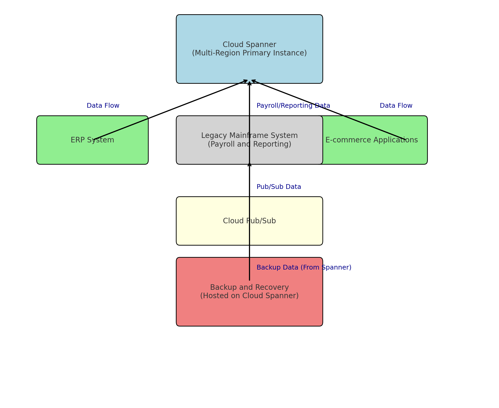
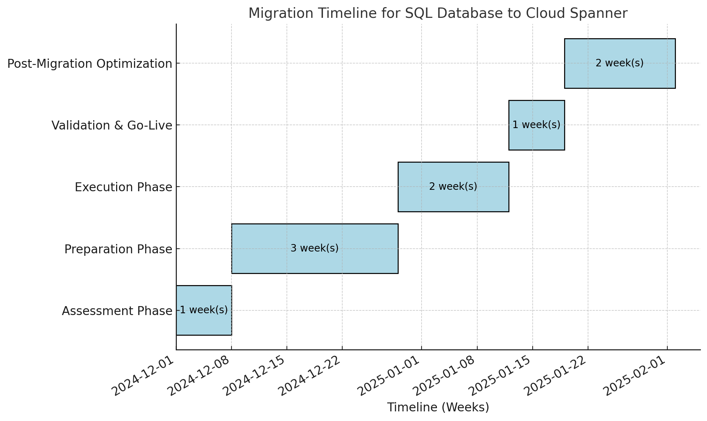

# **Migration of SQL Database Cluster to Google Cloud Spanner**

# Executive Summary

GlobalTech Solutions, a multinational company operating in 10 countries,
requires a scalable and secure solution for its critical **in-house SQL
database cluster**. This cluster stores sensitive customer and
operational data, supporting key business operations across its global
infrastructure. To address rising operational costs, scalability
limitations, disaster recovery needs, and compliance with international
regulations such as GDPR and HIPAA, this report proposes migrating the
database to **Google Cloud Spanner**. Cloud Spanner ensures superior
scalability, reliability, and compliance, meeting the organization's
requirements while minimizing downtime during migration.

# Challenges Addressed

1.  **Operational Costs**:

    -   Current on-premises infrastructure involves high maintenance and
        operational expenses.

    -   Cloud Spanner eliminates hardware dependencies and provides cost
        efficiencies through automated scaling.

2.  **Scalability**:

    -   With operations in 10 countries, the database must support
        multi-region workloads and future growth.

    -   Cloud Spanner's horizontal scaling ensures seamless expansion
        without downtime.

3.  **Disaster Recovery**:

    -   The database lacks robust disaster recovery mechanisms in its
        current state.

    -   Multi-region replication in Cloud Spanner guarantees data
        durability and low Recovery Time Objective (RTO).

4.  **Compliance**:

    -   The SQL database must adhere to GDPR and HIPAA regulations for
        sensitive customer and operational data.

    -   Cloud Spanner provides advanced security and compliance
        features, including encryption and detailed audit logs.

5.  **Downtime**:

    -   Migration downtime must not exceed **4 hours**, ensuring minimal
        disruption to critical services.

    -   Cloud Spanner supports real-time replication and schema changes,
        allowing for near-zero downtime.

# Proposed Solution: Migration to Google Cloud Spanner

The existing SQL database cluster, storing sensitive customer and
operational data, will be migrated to Cloud Spanner to address cost,
scalability, disaster recovery, and compliance challenges. The migration
must ensure data integrity, minimal downtime, and global availability.

**High-Level Architecture**:

-   **Primary Instance**: Cloud Spanner multi-region configuration to
    handle distributed workloads and global user access.

-   **Backup and Recovery**: Continuous backups and point-in-time
    recovery for operational resilience.

-   **Integration**: Integration with other systems, such as ERP and
    public-facing e-commerce applications, using APIs and Cloud Pub/Sub
    for real-time data flow.

**Migration Strategy for SQL Database Cluster to Google Cloud Spanner**

**1. Assessment Phase**

This phase focuses on understanding the current database environment and
planning the migration effectively:

1.  **Inventory and Discovery**:

    -   Document the existing database schema, relationships, and size.

    -   Identify dependencies with applications (ERP, e-commerce) and
        other databases.

2.  **Performance Analysis**:

    -   Measure current transaction throughput, query performance, and
        workload patterns.

    -   Identify high-priority use cases that demand optimization.

3.  **Compliance Review**:

    -   Evaluate existing compliance requirements for GDPR, HIPAA, and
        other relevant regulations.

4.  **Risk Assessment**:

    -   Identify risks such as unsupported features, downtime impact,
        and data integrity concerns.

5.  **Migration Planning**:

    -   Define a phased migration approach, starting with less critical
        workloads.

    -   Create a rollback plan to mitigate issues during migration.

**2. Preparation Phase**

Prepare the target environment in Google Cloud Platform (GCP) to ensure
a secure and efficient migration:

1.  **Set Up Cloud Spanner**:

    -   Create a multi-region Spanner instance to handle global
        workloads.

    -   Configure instance settings for high availability and
        performance.

2.  **Customer-Managed Encryption Keys (CMEK)**:

    -   Generate and manage encryption keys using Cloud KMS.

    -   Integrate CMEK with Cloud Spanner to encrypt data at rest.

3.  **Network Configuration**:

    -   Set up **VPC Service Controls** to secure data transfer and
        access.

    -   Configure firewall rules to allow only authorized traffic
        between Spanner and dependent applications.

4.  **Replication Setup**:

    -   Use **Database Migration Service (DMS)** to establish a
        replication pipeline for real-time data sync during migration.

5.  **Backup Strategy**:

    -   Set up automated backups in the source database for safety
        before initiating migration.

**3. Execution Phase**

Perform the migration with minimal disruption to ongoing operations:

1.  **Schema Conversion**:

    -   Use DMS to convert the source database schema to Cloud
        Spanner-compatible format.

    -   Test and validate schema conversion, resolving any compatibility
        issues.

2.  **Initial Data Migration**:

    -   Perform a full load of the existing database into Cloud Spanner.

    -   Validate data integrity and completeness post-migration.

3.  **Real-Time Replication**:

    -   Enable continuous data replication from the source database to
        Cloud Spanner using DMS.

    -   Monitor replication to ensure consistency between source and
        target databases.

4.  **Application Integration**:

    -   Test connectivity between applications (ERP, e-commerce) and
        Cloud Spanner.

    -   Implement API or Pub/Sub connections for real-time data flow.

**4. Validation and Go-Live**

Ensure the migrated database is fully functional and ready for
production:

1.  **Testing**:

    -   Conduct end-to-end testing of database operations, queries, and
        transactions.

    -   Test application interactions with Cloud Spanner to ensure no
        functionality is broken.

    -   Perform compliance checks to verify adherence to GDPR and HIPAA
        standards.

2.  **Performance Benchmarking**:

    -   Compare pre-migration and post-migration performance metrics to
        ensure improvements or parity.

3.  **User Acceptance Testing (UAT)**:

    -   Engage key stakeholders to validate that the system meets
        business needs.

4.  **Final Cutover**:

    -   Schedule the cutover during off-peak hours.

    -   Halt writes on the source database, perform a final sync, and
        redirect applications to Cloud Spanner.

    -   Ensure downtime does not exceed the 4-hour limit.

5.  **Post-Migration Validation**:

    -   Verify all data is accessible and applications are functioning
        as expected.

    -   Conduct a final compliance audit.

**5. Post-Migration Optimization**

After the database is live, fine-tune operations and monitor the system:

1.  **Performance Tuning**:

    -   Use Cloud Spanner's Query Insights to optimize slow queries and
        improve performance.

2.  **Monitoring**:

    -   Set up alerts and dashboards in Cloud Monitoring to track
        database health, performance, and usage.

3.  **Cost Optimization**:

    -   Review resource utilization and apply granular instance sizing
        or committed use discounts.

4.  **Continuous Backups**:

    -   Schedule regular backups and enable point-in-time recovery for
        data protection.

5.  **Training and Handover**:

    -   Train the IT team on managing and monitoring Cloud Spanner.

    -   Document all configurations and operational procedures for
        future reference.

# Compliance and Security Measures

1.  **Data Protection**:

    -   **Encryption**: CMEK ensures data is encrypted at rest and in
        transit, with the organization controlling encryption keys.

    -   **Access Controls**: Role-based access management using Google
        Cloud\'s **Identity and Access Management (IAM)**.

2.  **Disaster Recovery**:

    -   Multi-region deployment guarantees availability even during
        regional outages.

    -   Regular backups using Cloud Spanner's backup and restore
        functionality.

3.  **Regulatory Compliance**:

    -   **GDPR**: GCP provides tools to manage data in compliance with
        GDPR regulations.

    -   **HIPAA**: Enter into a Business Associate Agreement (BAA) with
        Google Cloud to handle protected health information securely.

# Cost Estimation

To estimate migration and operational costs, use the **Google Cloud
Pricing Calculator**.

[Google
Cloud](https://cloud.google.com/products/calculator?utm_source=chatgpt.com)

**Assumptions**:

-   **Compute Capacity**: 10 nodes in a multi-region configuration.

-   **Storage**: 500 GB of data.

-   **Network Egress**: 200 GB per month.

**Estimated Monthly Costs**:

-   **Compute Capacity**: 10 nodes × \$3.00/node/hour × 730 hours ≈
    \$21,900.

-   **Storage**: 500 GB × \$0.30/GB ≈ \$150.

-   **Network Egress**: 200 GB × \$0.12/GB ≈ \$24.

**Total Estimated Monthly Cost**: Approximately \$22,074.

**Cost Optimization**:

-   **Committed Use Discounts**: Consider one-year or three-year
    commitments to receive discounts of up to 40% on compute capacity.

[Google
Cloud](https://cloud.google.com/spanner/docs/cuds?utm_source=chatgpt.com)

-   **Granular Instance Sizing**: Utilize granular instance sizing to
    align resources with workload demands, potentially reducing costs.

[Google
Cloud](https://cloud.google.com/blog/products/databases/use-spanner-at-low-cost-with-granular-instance-sizing?utm_source=chatgpt.com)

**Benefits**

1.  **Global Performance**:

    -   Ensures low-latency access for users across 10 countries.

2.  **High Availability**:

    -   Multi-region replication provides 99.999% uptime.

3.  **Operational Simplicity**:

    -   Fully managed service eliminates hardware and maintenance
        overhead.

4.  **Regulatory Compliance**:

    -   Comprehensive tools for GDPR and HIPAA compliance.

5.  **Future-Ready**:

    -   Seamlessly handles growing workloads and evolving business
        needs.

# Conclusion

Migrating the SQL database cluster to Google Cloud Spanner is the
optimal solution for GlobalTech Solutions. This approach addresses
operational challenges while providing a robust, scalable, and compliant
database system. While the cost is significant, the long-term benefits
of enhanced performance, global availability, and operational simplicity
justify the investment, ensuring a future-proof infrastructure for the
organization.
