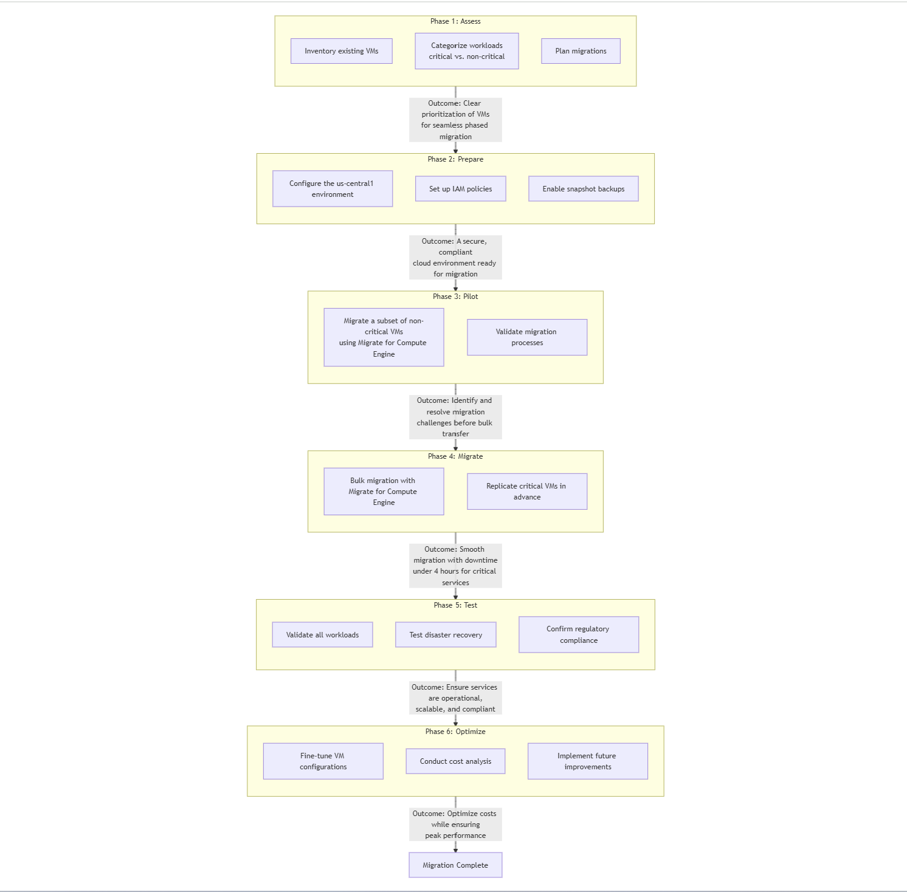

# Comprehensive Plan for Migrating 150 VMs to Google Cloud

This detailed strategy focuses on migrating **150 Windows and Linux VMs** to Google Cloud while addressing the following challenges:

1.  **Rising operational costs** for maintaining on-premises data centers.
2.  **Scalability and disaster recovery** to support future growth.
3.  **Compliance with international regulations** (e.g., GDPR, HIPAA).
4.  **Downtime limit** of under 4 hours for critical services.

The plan avoids unnecessary complexity by focusing on **Google Compute Engine** without using services like Cloud CDN or Load Balancing unless absolutely necessary.

**Challenges and Solutions**

| **Challenge**       | **Proposed Solution**                                                                                                                                          |
|---------------------|---------------------------------------------------------------------------------------------------------------------------------------------------------------|
| **Rising Operational Costs** | Transition from on-premises to a centralized Google Cloud region to reduce infrastructure and maintenance costs.                                      |
| **Scalability & Disaster Recovery** | Use **regional snapshots** for VM backups and failover, enabling high availability and quick recovery.                                          |
| **Compliance**      | Apply **Cloud IAM** for access control and **Cloud KMS** for data encryption to ensure compliance with GDPR and HIPAA.                                         |
| **Downtime Limits (<4 Hours)** | Phased migration strategy with pre-replication of critical VMs to ensure minimal service disruption.                                                  |

**Proposed Architecture**

1.  **Primary Region**:
    -   Host all VMs in **us-central1** (Iowa) to ensure optimal performance and cost efficiency for global users.
    -   Centralized operations simplify management and improve latency for users in the US.

2.  **Disaster Recovery Region**:
    -   Backup critical VM snapshots to **us-east1** (South Carolina).
    -   Maintain rapid recovery capabilities in case of regional outages.

3.  **VM Types**:
    -   **n1-standard-4**: General-purpose VMs for non-critical workloads.
    -   **n1-highmem-4**: Memory-optimized VMs for critical workloads requiring higher performance.

4.  **Compliance Tools**:
    -   **Cloud IAM**: Assign role-based access controls to enforce data security.
    -   **Cloud KMS**: Encrypt sensitive data at rest and in transit.

**Phased Migration Plan**

| **Phase**         | **Action**                                             | **Outcome**                                                                                  |
|-------------------|-------------------------------------------------------|---------------------------------------------------------------------------------------------|
| **Phase 1: Assess** | Inventory existing VMs, categorize workloads (critical vs. non-critical), and plan migrations. | Clear prioritization of VMs for seamless phased migration.                                  |
| **Phase 2: Prepare** | Configure the **us-central1** environment, set up IAM policies, and enable snapshot backups.   | A secure, compliant cloud environment ready for migration.                                  |
| **Phase 3: Pilot** | Migrate a subset of non-critical VMs using **Migrate for Compute Engine** to validate processes. | Identify and resolve migration challenges before bulk transfer.                             |
| **Phase 4: Migrate** | Use **Migrate for Compute Engine** for bulk migration. Replicate critical VMs in advance.      | Ensure smooth migration with downtime under 4 hours for critical services.                 |
| **Phase 5: Test** | Validate all workloads, test disaster recovery, and confirm regulatory compliance.               | Ensure services are operational, scalable, and compliant.                                   |
| **Phase 6: Optimize** | Fine-tune VM configurations for performance and conduct cost analysis for future improvements. | Optimize costs while ensuring peak performance.                                             |

**Cost and Performance Summary**

| **Component**          | **Details**                     | **Monthly Cost (USD)** | **Notes**                                                                                  |
|------------------------|--------------------------------|-----------------------|------------------------------------------------------------------------------------------|
| **Compute Engine (VMs)** | 100 **n1-standard-4** + 50 **n1-highmem-4** | \$16,400.00           | Hosted in us-central1.                                                                    |
| **Persistent Disk (Storage)** | 75TB of standard persistent disk storage | \$6,200.00            | Supports high IOPS workloads.                                                             |
| **Snapshots (Backup)** | Regional snapshots for disaster recovery      | \$800.00              | Backup stored in us-east1.                                                                |
| **Compliance Tools**   | IAM, KMS, and audit logging                   | \$700.00              | Meets GDPR and HIPAA requirements.                                                       |
| **Total Monthly Cost** |                                | **\$24,100.00**       | Cost-efficient while addressing performance and compliance.                               |

**Detailed Explanation of Key Challenges and Solutions**

**1. Rising Operational Costs**

-   **Challenge**: Maintaining on-premises data centers leads to high infrastructure, power, and cooling costs.
-   **Solution**:
    -   Migrate to Google Compute Engine to eliminate hardware maintenance costs.
    -   Leverage usage discounts (e.g., Sustained Use Discounts) to reduce costs.

**2. Scalability and Disaster Recovery**

-   **Challenge**: Current on-premises setup cannot easily scale to handle future growth or recover from disasters.
-   **Solution**:
    -   Use **Compute Engine Autoscaling** to dynamically adjust resources.
    -   Enable **regional snapshots** for backups and failover to us-east1.

**3. Compliance**

-   **Challenge**: Ensure international regulations like GDPR and HIPAA are met.
-   **Solution**:
    -   **Cloud IAM** restricts access based on user roles and regions.
    -   **Cloud KMS** encrypts sensitive data to meet compliance standards.

**4. Downtime Limit (<4 Hours)**

-   **Challenge**: Critical services cannot experience downtime longer than 4 hours.
-   **Solution**:
    -   Pre-replicate critical VMs to Google Cloud using **Migrate for Compute Engine**.
    -   Schedule migrations during off-peak hours and validate post-migration readiness.

**Key Benefits**

1.  **Cost Efficiency**:
    -   Centralized hosting in us-central1 reduces operational complexity and costs.

2.  **Global Availability**:
    -   Critical workloads are accessible worldwide with low latency from us-central1.

3.  **High Scalability and Disaster Recovery**:
    -   Resources scale dynamically, and regional backups ensure quick recovery.

4.  **Compliance and Security**:
    -   Built-in tools simplify adherence to GDPR, HIPAA, and other international laws.

5.  **Minimal Downtime**:
    -   Pre-replication and phased migration ensure service disruptions remain under 4 hours.
